# DAUNS Extension Architecture

```mermaid
graph TD
    A[VS Code Editor] --> B[Extension Activation]
    B --> C[Command Registration]
    C --> D[User Interaction]
    D --> E[Scan Variables Command]
    D --> F[Detect Unused Variables]
    D --> G[Scan Workspace]
    D --> H[Scan Folder]
    D --> I[Analyze Dependencies]
    D --> J[Track Lifecycle]
    D --> K[Rename Variable]
    D --> L[Extract Variable]
    D --> M[Convert Variable]
    D --> N[Inline Variable]
    E --> O[Variable Scanner Module]
    F --> P[Unused Variable Detector]
    G --> Q[Workspace Scanner]
    H --> Q
    I --> R[Dependency Analyzer]
    J --> S[Variable Lifecycle Tracker]
    K --> T[Rename Provider]
    L --> U[Extract Variable Provider]
    M --> V[Convert Variable Provider]
    N --> W[Inline Variable Provider]
    O --> X[Regex Pattern Matching]
    X --> Y[Variable Detection]
    Y --> Z[Type Inference]
    Z --> AA[Results Processing]
    AA --> AB[Quick Pick UI]
    AA --> AC[Tree View Provider]
    P --> AD[Usage Analysis]
    AD --> AE[Unused Variable Identification]
    Q --> AF[Multi-file Processing]
    AF --> AG[Progress Management]
    AG --> AH[Results Aggregation]
    AH --> AC
    R --> AI[Dependency Analysis]
    AI --> AJ[Circular Dependency Detection]
    AJ --> AK[Webview Display]
    S --> AL[Lifecycle Tracking]
    AL --> AM[Event Analysis]
    AM --> AK
    T --> AN[Workspace-wide Rename]
    AN --> AO[Preview Generation]
    AO --> AK
    U --> AP[Code Extraction]
    AP --> AQ[Smart Naming]
    V --> AR[Declaration Conversion]
    AR --> AS[Smart Recommendations]
    W --> AT[Variable Inlining]
    AT --> AU[Safety Checks]
    AB --> AV[Display Results]
    AC --> AV
    AE --> AW[Unused Variables Display]
    AV --> AX[User Selection]
    AW --> AX
    AX --> AY[Navigate to Variable]
    AN --> AZ[Apply Changes]
    AP --> AZ
    AR --> AZ
    AT --> AZ

    subgraph Extension Components
        B
        C
        O
        P
        Q
        R
        S
        T
        U
        V
        W
        AC
    end

    subgraph Analysis Process
        X
        Y
        Z
        AD
        AF
        AI
        AL
    end

    subgraph Refactoring Tools
        AN
        AP
        AR
        AT
        AO
        AQ
        AS
        AU
    end

    subgraph User Interaction
        D
        AB
        AC
        AV
        AW
        AX
        AY
    end

    subgraph Data Management
        AA
        AG
        AH
    end

    subgraph Advanced Analysis
        AI
        AL
        AJ
        AM
    end

    subgraph Refactoring Operations
        AZ
    end
```

## Component Details

### 1. Extension Entry Point (extension.ts)

- Activates when any DAUNS command is triggered
- Registers all commands with VS Code
- Manages different scanning modes
- Handles the user interface flow

### 2. Variable Scanner (variableScanner.ts)

- Analyzes the document text using regex patterns
- Detects `let`, `const`, and `var` declarations
- Performs basic type inference based on assignments
- Returns structured variable information

### 3. Tree View Provider (treeViewProvider.ts)

- Implements VS Code's Tree View API
- Provides hierarchical display of variables
- Manages tree view state and updates
- Handles file and variable tree items

### 4. Workspace Scanner (workspaceScanner.ts)

- Handles multi-file scanning operations
- Implements progress indication and cancellation
- Uses VS Code's file system API to find files
- Manages large-scale variable analysis

### 5. Unused Variable Detector (unusedVariableDetector.ts)

- Analyzes variable usage patterns
- Identifies potentially unused variables
- Provides user-friendly reporting
- Implements regex-based usage counting

### 6. Configuration Manager (configManager.ts)

- Manages extension settings
- Handles configuration updates
- Provides typed access to settings
- Listens for configuration changes

### 7. Dependency Analyzer (dependencyAnalyzer.ts)

- Analyzes relationships between variables
- Detects circular dependencies
- Builds dependency graphs
- Provides formatted output for display

### 8. Variable Lifecycle Tracker (variableLifecycle.ts)

- Tracks variable events throughout their lifetime
- Analyzes scope information
- Identifies unusual usage patterns
- Provides lifecycle visualization

### 9. Cross Reference Tracker (crossReferenceTracker.ts)

- Tracks variable usage across multiple files
- Identifies hotspots and dead code
- Builds cross-reference maps
- Supports workspace-wide analysis

### 10. Refactoring Tools (src/refactoring/)

- Provides automated code improvement capabilities
- Includes rename, extract, convert, and inline operations
- Offers smart suggestions based on code analysis

#### Rename Provider (renameProvider.ts)

- Workspace-wide variable renaming
- Preview generation and display
- Progress indication with cancellation
- Safe text replacement operations

#### Extract Variable Provider (extractVariableProvider.ts)

- Code extraction tools
- Smart naming suggestions
- Scope analysis for optimal placement
- Text selection and replacement

#### Convert Variable Provider (convertVariableProvider.ts)

- Variable declaration conversion
- Usage pattern analysis
- Best practice recommendations
- Declaration keyword replacement

#### Inline Variable Provider (inlineVariableProvider.ts)

- Variable inlining tools
- Usage detection and replacement
- Safety checks and user confirmation
- Declaration removal

#### Refactoring Commands (refactoringCommands.ts)

- Command registration with VS Code
- User interaction flow coordination
- Error handling and user feedback

## Data Flow

1. User triggers a command via context menu, command palette, or explorer
2. Extension routes to appropriate handler based on command type
3. Scanner/processor analyzes document(s) using regex patterns
4. Variable detection and type inference occurs
5. Results are processed and formatted for display
6. Data is sent to appropriate UI component (Quick Pick, Tree View, or Webview)
7. User interacts with results to navigate to variables or view analysis
8. For refactoring operations, user input is processed and changes are applied

## Enhanced Features Architecture

### Tree View Implementation

- Uses VS Code's TreeDataProvider interface
- Implements hierarchical organization by file
- Provides refresh and clear functionality
- Integrates with VS Code's Explorer panel

### Workspace Scanning

- Leverages VS Code's findFiles API
- Implements progress reporting with cancellation
- Handles large file sets efficiently
- Aggregates results across multiple files

### Unused Variable Detection

- Performs usage analysis through text scanning
- Implements intelligent counting to avoid false positives
- Provides detailed reporting of usage patterns
- Integrates with existing UI components

### Configuration Management

- Uses VS Code's configuration API
- Provides typed access to settings
- Handles default values and validation
- Listens for configuration changes to update behavior

### Advanced Analysis Features

#### Dependency Analysis

- Text-based parsing to identify variable relationships
- Circular dependency detection using graph algorithms
- Webview display for detailed analysis
- Integration with existing variable data

#### Lifecycle Tracking

- Event-based tracking of variable usage
- Scope analysis for visibility understanding
- Pattern recognition for unusual behavior
- Webview display for comprehensive view

#### Cross-Reference Tracking

- Multi-file analysis for project-wide insights
- Hotspot identification for frequently used variables
- Dead code detection across the entire workspace
- Integration with tree view for navigation

### Refactoring Tools

#### Rename Operations

- Workspace-wide file scanning
- Preview panel generation
- Progress indication with cancellation
- Safe text replacement using VS Code's WorkspaceEdit API

#### Extract Operations

- Scope analysis for optimal declaration placement
- Smart naming algorithm based on expression content
- Text selection and replacement operations

#### Convert Operations

- Usage pattern analysis for smart recommendations
- Declaration keyword replacement
- Best practice suggestions

#### Inline Operations

- Usage detection and replacement
- Declaration removal
- Safety checks and user confirmation

## Module Interactions

### Core Analysis Pipeline

1. VariableScanner identifies all variables in a document
2. Results are passed to various analysis modules:
   - UnusedVariableDetector for usage analysis
   - DependencyAnalyzer for relationship analysis
   - VariableLifecycleTracker for lifecycle analysis
3. Analysis results are formatted for display
4. UI components present the information to the user

### Workspace Analysis Pipeline

1. WorkspaceScanner identifies all relevant files
2. VariableScanner processes each file
3. CrossReferenceTracker builds usage maps across files
4. Results are aggregated and displayed in TreeView
5. Advanced analysis can be triggered on demand

### Refactoring Pipeline

1. User triggers refactoring command
2. Appropriate provider analyzes context and selections
3. Preview or suggestions are generated
4. User confirms or modifies the operation
5. Changes are applied using VS Code's editing APIs
6. Results are reported to the user

## Performance Considerations

### Memory Management

- Efficient data structures for storing analysis results
- Cleanup of unused data when views are closed
- Lazy loading of detailed information

### Processing Efficiency

- Text-based parsing for speed
- Incremental updates when possible
- Cancellation support for long operations
- Progress indication for user feedback

### UI Responsiveness

- Webview panels for complex data display
- Asynchronous processing to avoid blocking the UI
- Pagination for large result sets

## Extensibility

The modular architecture allows for easy addition of new features:

1. Create a new analyzer or provider module
2. Add command registration in extension.ts
3. Implement result display (Quick Pick, Tree View, or Webview)
4. Update documentation and user interface

### Adding New Refactoring Tools

1. Create a new provider in [src/refactoring/](file:///D:/DAUNS/src/refactoring/)
2. Register the command in [refactoringCommands.ts](file:///D:/DAUNS/src/refactoring/refactoringCommands.ts)
3. Add menu entries in [package.json](file:///D:/DAUNS/package.json)
4. Update documentation
