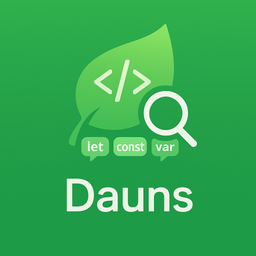

# 🌿 Dauns - Variable Detective for VS Code

  

> A VS Code extension that detects and displays all variables in JavaScript/TypeScript files with detailed information.

## ✨ Features

- Detect variables declared with `let`, `const`, and `var`
- Support for `.js`, `.ts`, `.jsx`, `.tsx` files
- Display variable type information and declaration position
- Clean Quick Pick UI for easy navigation
- **Tree View Panel** for hierarchical variable display
- **Workspace-wide scanning** for multi-file analysis
- **Unused variable detection** for dead code identification
- **Configurable settings** for customization
- **Folder-specific scanning** from explorer context menu
- **Variable dependency analysis** to understand relationships
- **Variable lifecycle tracking** to monitor usage patterns
- **Cross-reference tracking** across multiple files
- **Refactoring tools** for code improvement
- **Smart variable naming suggestions**
- **Variable conversion recommendations**
- **Multi-language support** for Python, Vue.js, JSON, and YAML files
- **Advanced UI Components**:
  - Variable hover information with quick actions
  - Visual decorations for unused, shadowed, and global variables
  - Minimap indicators for variable declarations and references
  - Breadcrumb navigation for variable scopes
  - Custom tree view icons with status indicators
  - Interactive variable panel with detailed information
- **Performance Optimization**:
  - Async scanning with simulated web workers
  - Intelligent caching system for faster repeated scans
  - Memory management to prevent excessive resource usage
  - Debounced file watching to reduce unnecessary processing
  - Performance monitoring and reporting
- **AI-powered Features**:
  - Smart variable analysis with naming and usage recommendations
  - Code quality metrics and improvement suggestions
  - Security vulnerability detection for variable usage
  - Team collaboration for sharing analysis results
  - Internationalization (i18n) support with multiple languages

## 🚀 Installation

1. Install the extension from the VS Code Marketplace
2. Reload VS Code if prompted

## 📖 Usage

### Single File Analysis

1. Open a JavaScript, TypeScript, Python, Vue.js, JSON, or YAML file
2. Right-click in the editor and select "Scan Variables in Current File"
3. Browse through the detected variables in the Quick Pick menu or DAUNS Variables tree view
4. Select a variable to navigate to its declaration

### Workspace Analysis

1. Open a workspace folder
2. Use the Command Palette (`Ctrl+Shift+P` or `Cmd+Shift+P`) and run "DAUNS: Scan Variables in Workspace"
3. View all variables across your project in the DAUNS Variables tree view

### Unused Variable Detection

1. Open a JavaScript or TypeScript file
2. Right-click in the editor and select "Detect Unused Variables"
3. Review the list of potentially unused variables

### Variable Dependency Analysis

1. Open a JavaScript or TypeScript file
2. Right-click in the editor and select "Analyze Variable Dependencies"
3. View a detailed analysis of variable relationships in a webview panel

### Variable Lifecycle Tracking

1. Open a JavaScript or TypeScript file
2. Right-click in the editor and select "Track Variable Lifecycle"
3. View the complete lifecycle of variables from declaration to usage

### Refactoring Tools

1. Open a JavaScript or TypeScript file
2. Select text to extract or place cursor on a variable declaration
3. Right-click and select from the "Refactoring" submenu:
   - **Rename Variable Across Workspace**: Rename a variable across all files with preview
   - **Extract Variable**: Extract selected code into a new variable
   - **Extract Variable with Smart Naming**: Extract with intelligent naming suggestions
   - **Convert Variable Declaration**: Change var/let/const declaration
   - **Convert Variable with Smart Suggestions**: Get recommendations for best declaration type
   - **Inline Variable**: Replace variable usages with its value

### Advanced UI Features

1. **Hover Information**: Hover over any variable to see detailed information including type, scope, and references
2. **Visual Decorations**:
   - Unused variables are shown with a line-through and warning color
   - Shadowed variables are highlighted with an error border
   - Global variables are displayed in bold
3. **Minimap Indicators**: Variable declarations and references are shown in the minimap for quick navigation
4. **Breadcrumb Navigation**: Use the breadcrumbs to navigate between variable scopes
5. **Interactive Panel**: Use "Show Interactive Variable Panel" command to open a detailed view of all variables

### Performance Monitoring

1. Use "Show Performance Report" command to view detailed performance metrics
2. The extension automatically caches results for faster repeated scans
3. Memory usage is monitored and managed to prevent excessive resource consumption
4. File updates are debounced to reduce unnecessary processing

### AI-Powered Features

1. **Code Quality Analysis**:

   - Provides detailed metrics and recommendations for improving code quality
   - Suggests variable-specific improvements for better naming and usage

2. **Security Analysis**:

   - Identifies potential security vulnerabilities in variable usage
   - Provides recommendations for addressing security issues

3. **Team Collaboration**:

   - Allows saving and sharing analysis results with team members
   - Supports adding comments and collaborating on code reviews

4. **Language Selection**:
   - Supports multiple languages for the extension UI

### Folder Analysis

1. Right-click on any folder in the Explorer
2. Select "Scan Variables in Folder"
3. View variables specific to that folder

## 🛠️ Development

### Prerequisites

- Node.js (version 18 or higher)
- VS Code

### Setup

1. Clone the repository
2. Run `npm install` to install dependencies
3. Open the project in VS Code
4. Press `F5` to compile and run the extension in a new Extension Development Host window

### Build

- Run `npm run compile` to compile the extension
- Run `npm run watch` to compile in watch mode

### Testing the Extension

1. Open the example.js file included in the project
2. Press `F5` to launch the extension in a new Extension Development Host window
3. In the new window, right-click on the example.js file and select "Scan Variables in Current File"
4. You should see a list of all detected variables with their types and positions

## ⚙️ Configuration

The extension can be configured through VS Code settings:

- `dauns.fileExtensions`: File extensions to scan for variables
- `dauns.includeNodeModules`: Include node_modules directory in workspace scans
- `dauns.maxFileSizeKB`: Maximum file size to scan (in KB)
- `dauns.showFunctionVariables`: Show function variables in results
- `dauns.showUnusedVariablesWarning`: Show warning for unused variables
- `dauns.customVariablePatterns`: Custom regex patterns for variable detection
- `dauns.locale`: Language for the extension interface
- `dauns.aiAnalysisEnabled`: Enable or disable AI-powered variable analysis
- `dauns.securityAnalysisEnabled`: Enable or disable security vulnerability analysis
- `dauns.teamCollaborationEnabled`: Enable or disable team collaboration features

## 📚 Documentation

- [Usage Guide](USAGE.md) - Detailed instructions on using the extension
- [Features](FEATURES.md) - Comprehensive feature documentation
- [Architecture](ARCHITECTURE.md) - Technical architecture and design
- [Project Structure](PROJECT_STRUCTURE.md) - File organization and purpose
- [Roadmap](ROADMAP.md) - Future development plans
- [Analysis Features](ANALYSIS.md) - Advanced analysis capabilities
- [Summary](SUMMARY.md) - Project overview and implementation details
- [Multi-Language Parser System](MULTI_LANGUAGE_PARSER_SUMMARY.md) - Details about multi-language support
- [Advanced UI Components](ADVANCED_UI_COMPONENTS.md) - Information about advanced UI features
- [Performance Optimization](PERFORMANCE_OPTIMIZATION.md) - Details about performance features
- [Performance Optimization Summary](PERFORMANCE_OPTIMIZATION_SUMMARY.md) - Implementation summary
- [AI Features](AI_FEATURES.md) - Details about AI-powered features
- [Refactoring](REFACTORING.md) - Refactoring capabilities
- [UI Implementation Summary](UI_IMPLEMENTATION_SUMMARY.md) - UI component implementation
- [Implementation Summary](IMPLEMENTATION_SUMMARY.md) - Complete implementation overview
- [Final Summary](FINAL_SUMMARY.md) - Final development summary

## 🤝 Contributing

Contributions are welcome! Please feel free to submit a Pull Request.

See [CONTRIBUTORS.md](CONTRIBUTORS.md) for information about the project creator and contribution guidelines.

## 👤 Creator

**Rasya Andrean**

- Email: [rasyaandrean@outlook.co.id](mailto:rasyaandrean@outlook.co.id)
- GitHub: [RasyaAndrean](https://github.com/RasyaAndrean)

## 📝 License

This project is licensed under the MIT License - see the [LICENSE](LICENSE) file for details.
